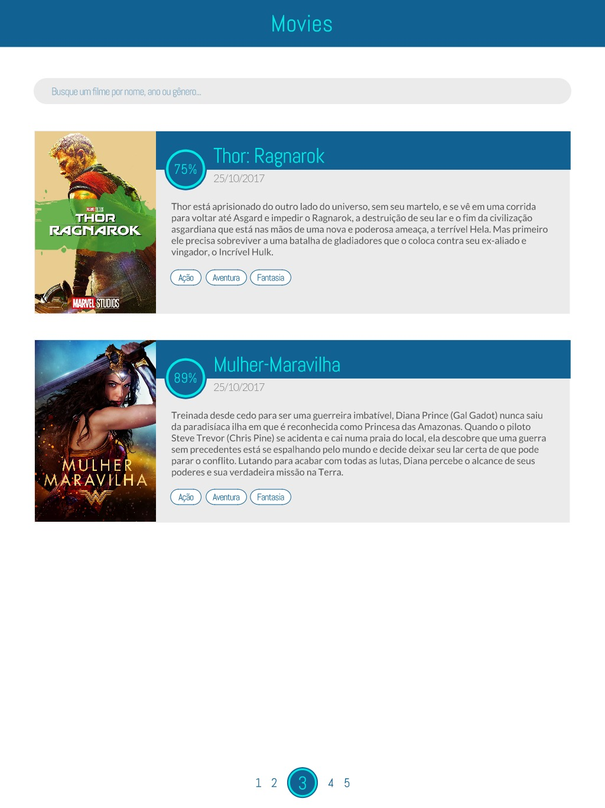
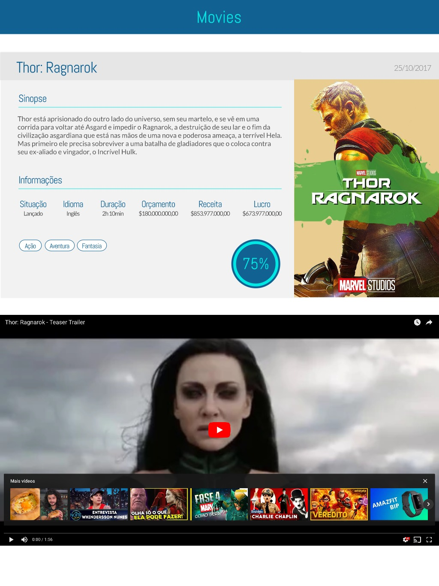

# Desafio técnico web - processo seletivo da [Cubos](https://cubos.io)

## Objetivo

Implementar um web app responsivo que consuma a [API do The Movie DB](https://www.themoviedb.org/documentation/api) e permita buscar e ver detalhes de filmes de seu catálogo.

## Especificações
### Especificações obrigatórias

O web app _deve_:

- Ter as seguintes funcionalidades:
    - Permitir buscar filmes por nome ou gênero
    - Resultados de busca paginados, 5 por página
    - Exibir nos resultados da busca: nome, cartaz, data de lançamento, sinopse e pontuação do filme
    - Possa ver, ao clicar em um resultado da busca, detalhes do filme além dos mostrados na busca, como: status (lançado, previsto, etc), idioma, duração, orçamento, receita, lucro, categorias e trailer, quando disponíveis.
- Ser responsivo
- Ter boa performance
- Funcionar na última versão dos principais browsers (Chrome, Firefox, Safari e Edge)
- Reproduzir os layouts a seguir:

> Resultados de busca

> Detalhes de filme

Vale citar que as fontes usadas nos layouts foram Abel e Lato.

O web app _não pode_:

- Fazer uso de frameworks CSS, como Bootstrap e Foundation

### Especificações adicionais

As especificações a seguir _não são obrigatórias_, mas contam pontos _extras_:

- Ter HTML semântico
- Fazer uso de técnicas avançadas em CSS, HTML e Javascript
- Demonstrar domínio de features modernas (ES6+) do Javascript
- Funcionar em browsers mais antigos
- Ser um PWA
- Fizer uso de uma ou mais ferramentas de nossa stack:
    - React
    - Typescript
    - Redux/MobX

#
